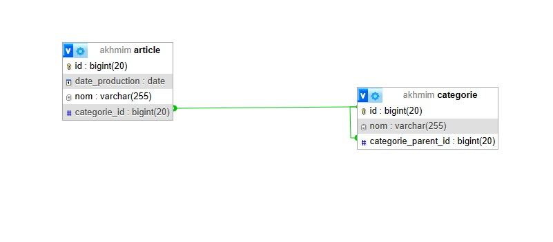
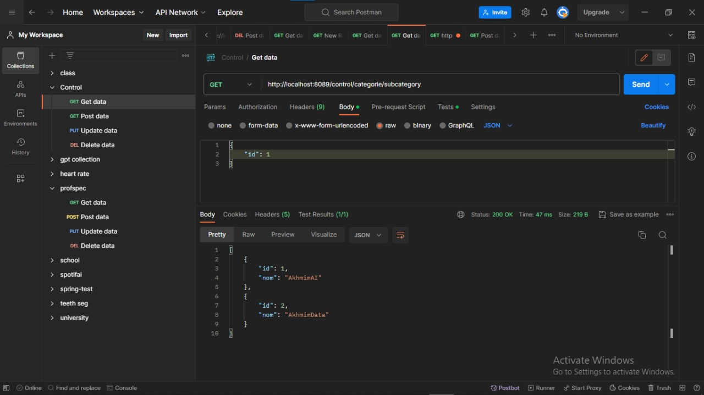

## Projet Java Springboot de Gestion des Articles et Categories ##

##La Conception

- **Demo:**

- **Gestion des Categories:**

   

## les fonctionnalités implémentées
1. les operations CRUD pour les deferentes entites
2. Gestion des Articles 
3. Gestion des Categories
4. Affichage des Sous-Categories
5. Affichage la liste des articles pour une categorie

##Les Technologies Utilisées
+ SpringBoot (Java Framework) 
+ JPA
+ MySQL DB
+ Rest Repositories 
+ Swagger Doc
+ Maven

"#JEE control" 

#### Credit by "Akhmim Abdelilah"
